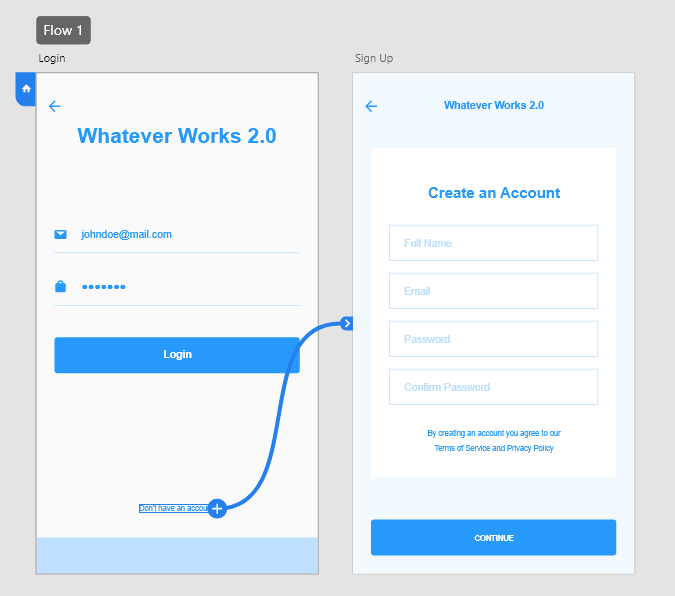

# USER STORY
```
as an end user when i navigate to the website
i am presented with a login menu where i enter my username and password
if i do not have a username and password i can select 'sign up' to create a user account
when i create a user account i am presented with three user role options (admin, read/write, read only)
when i log in to my profile as an admin i am prestend with a covid screening form
as an admin user i am allowed to add options to the symptoms dropdown menu and/or fill out and submit a form and add a new user
when i log in to my profile as a basic user i am presented with the option to fill out and submit a form
when i log into my profile as a read only user i am presented with a form that i cannot edit or submit
as any user when i am done with my session i can select an option to logout and will be routed back to the login screen
```
## WEB PAGE(s)
- Login/Signup
- Landing Page
- *Conditionally renders based on roles
- **IF admin -> ability to add user, fill out form, or view data (can be as simple as three buttons) NOTE: fucntion over anything
- **IF read/write -> ability to fill out form or view data
- **IF read only -> displays the data only
- Data View (MVP Only - Not required for class project)
- *Queries (To Write)
- ** Count by symptoms 
- ** Positive contacts
- ** Positive tests

## ROLES AND PERMISSIONS
- "Admin": can create new users, can fill out a form, can view data
- "Read/Write" (was Manager): can fill out a form, can view data
- "Read Only" (was Director): can only view data

## PROJECT CRITERIA
- Performant JavaScript
- NoSQL databases
- Progressive Web Application (PWA)
- React single-page application
- GraphQL APIs
- Concurrent servers in a MERN application
- Authentication

## PROJECT REQS
- React for the front end
- GraphQL with a Node.js and Express.js server
- Use MongoDB and the Mongoose ODM for the database
- Use queries and mutations for retrieving, adding, updating and deleting data
- Deploy to Heroku (with data)
- Be POLISH
- PWA (web manifest, service workers, is installable)
- Responsive UI
- Be interactive
- JWT Authentication
- Protect sensitive API key information on the server
- Clean repo and high quality readme
- Add to your react portfolio

# Beta Mock-Up(s)


